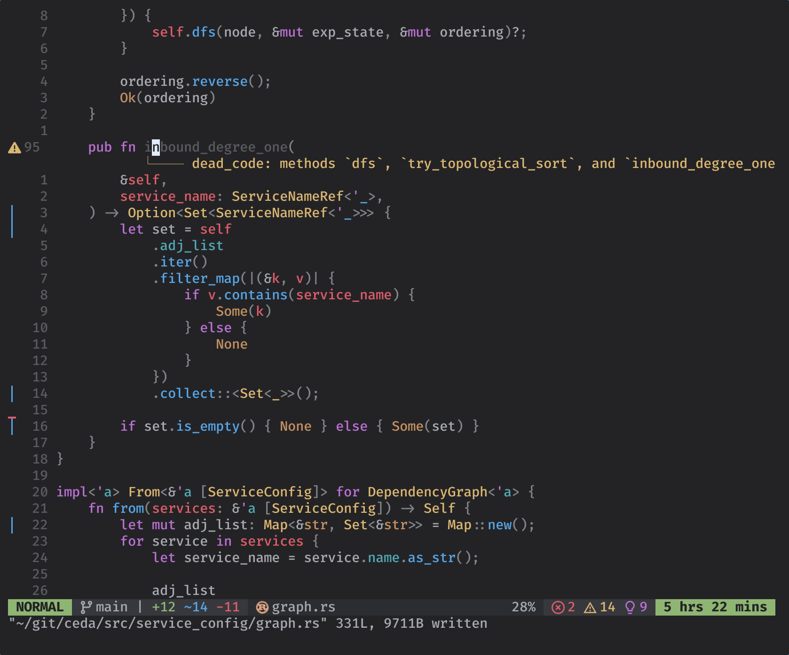

# NixVim

This repo contains a nix flake with my NixVim config.

## Flake Outputs

The flake exposes 2 version of NixVim, one bundled with dependencies (`fzf`,
`yazi`, etc. ), and one without.

Run either like so:

```sh
# Includes all dependencies
nix run github:wyatt-avilla/nixvim

# Only Neovim
nix run github:wyatt-avilla/nixvim#nvim-minimal
```

## Screenshot


